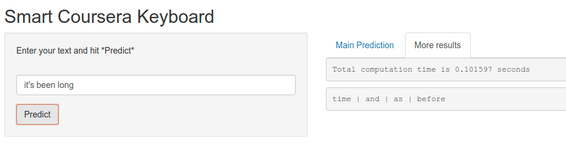

Capstone Project - Data Science Specialization
========================================================
author: pgrandinetti (github.com/pgrandinetti)
date: June 26, 2018
autosize: true

Background
========================================================

This pitch presents the capstone project for the Data Science Specialization, offered by the John Hopkins University via Coursera.

The scope of the work is to pitch an app that predicts (or rather, suggests) the next word in a sentence, given the same sentence as input.

```
Example: I given the input sentence "how are", the app should suggest "you"
```

We will now:

  - Briefly explain the development and algorithms behind the application
  - Illustrate how to use the app
  - Outline conclusions and possible improvements

The algorithm
========================================================

To develop the app we have been given a dataset containing a few millions of text document (taken from blogs, news and twitter).

We have built a **system of n-grams** to use as statistical backgroun to make a prediction.

Three points make the strategy attractive:

  - Building n-grams is a known problem for which there exist ready-to-use packages (we used `tm` and `Rweka`, the more recent `ngrams` is also worth considering)
  - We make prediction based on the occurrence of n-grams, and this prediction is weighted by three factors (more on this in the next slide)
  - We built a SQLite database that is used as **knowledge base**. The database is just a few MBs, which is very common even for mobile apps. Furthermore, this way we don't need to hold all ngrams in the memory of the device. Finally, an optimized SQL query fetches directly from the knowledge base the predictions.

More technical details: Example
========================================================

Let "what is going" be the input sentence, and let assume the predictions found via 3-gram ("what is going") are `to`, with count `5`, and on, with count `4`, while the 2-gram ("is going") predicts `there` with count `15`.

At this point we multiply the counts for `to` and `on` by the weight `x3` (the weight for the 3-gram), and the count for `there` by the weight `x2`, and finally return the prediction with the best score.

  - We decided the weights `x3`, `x2` and `x1` by using cross-validation on a validation set with 3k examples (1k blog, 1k news and 1k tweet)!
  - Notice that this is not the default behavior for the _back-off models_, but the combination of SQLite database, advanced-SQL query and cross-validation gave a very good and extremely efficient result!
  

App illustration
========================================================

The design of the app is intentionally very simple. We believe a keyboard should be very very easy to use.



  - Try it! [https://pgrandinetti.shinyapps.io/courserakeyboard/](https://pgrandinetti.shinyapps.io/courserakeyboard/)
