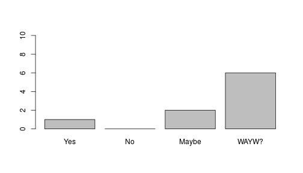

Data Product class - Shiny App
========================================================
author: pgrandinetti
date: 20 May, 2018
autosize: false
width: 1920
height: 1080

Scenario
========================================================

- Pete is a young programmer who, thanks to Coursera and Data Science specialization, has just discovered git
- In the past years Pete has written a lot of code, for various reasons; mostly for fun!
- All of Pete's projects were one-man projects, so he actually wonders whether move all his codes within github or not

	+ Pete asks for our help!

	+ He has developed a Shiny App in order to collect suggestions from his Coursera classmate

How to use the Shiny App
========================================================

- Reach the following link with your browser https://pgrandinetti.shinyapps.io/shinyApp
- The app explains by itself!

	+ You will read the instruction on the left
	+ If you prefer, there is a short explanation in the tab Documentation, on the right
	+ If it is not enough for you, in the same tab there is also the link to the complete pdf documentation!

- Select your preference. What is your advice for Pete?
- Then submit it! You will see the results!
	+ The app stores all of the received submissions, so that Pete can see all advices. But it does so only for 6 hours (Pete sets this idle time in the Shiny server). He hopes it is enough!


Technical tips
========================================================
- Pete thinks it is nice that his App can remember values from all submissions
- To do so, he had to use the correct scope

```r
#take the submitted value from the 'id2'
value <- as.numeric(input$id2)
# update the history
values[value] <<- values[value] + 1 #that's the trick with the scope!
```
- Also, the App is *event reactive*

```r
# datainput will later became the plot
datainput <- eventReactive(
	# place your reactive code here!
)
```


Visualizing the result
========================================================
- After some thinking Pete has chosen a ``` barplot``` visualization
- Let's assume the ``` values``` variable given by the datainput function (see previous slide) contains the following
	+ Yes = 1 vote, No = 0 vote, Maybe = 2 votes, What are your waiting? = 6 votes


- Then it will run

```r
barplot(values,names.arg = c('Yes','No','Maybe','WAYW?'),ylim = c(0,10))
```



Thank you!
